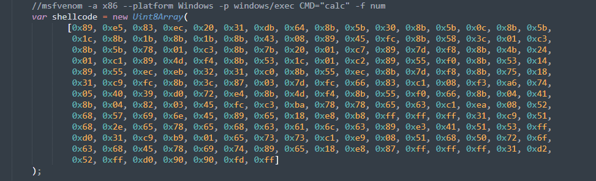

## burpsuite蜜罐

该蜜罐利用了burpsuitev2.0版本中内嵌的chromel浏览器js代码执行漏洞进行反制

参考文章：https://www.anquanke.com/post/id/252591

## 使用方法

修改api.js中的shellcode



shellcode可使用msfvenom生成

例如：

```bash
msfvenom -a x86 --platform Windows -p windows/exec CMD="calc" -f num
```

启动burpHoneyPot.exe即可在本地开启一个http服务，端口号可自定义。


然后等待攻击者使用burp测试或扫描本网站时即可触发shellcode执行命令

