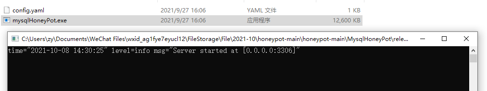
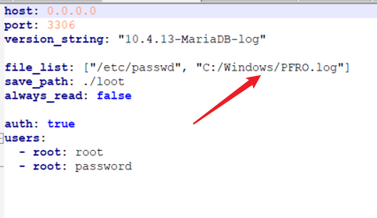
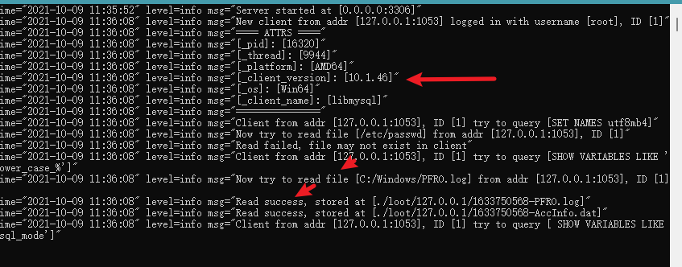
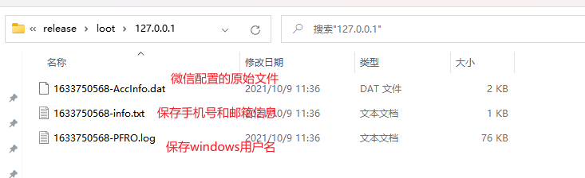

### 工具说明

mysql蜜罐，仅可支持读取文件。

目前读取的文件内容为微信配置文件，可读取到微信号，手机号和邮箱地址。

### 使用方法

双击执行`release`文件下的exe，启动蜜罐

可修改配置文件`config.yaml` 读取其他内容，也可修改mysql端口号、用户名密码等

受害者使用 Navicat 或者其它工具进行连接后即可读取其电脑上的微信用户名和手机号，邮箱等信息，保存结果存放在`loot`文件夹下。

`loot`文件夹下各文件保存信息:

